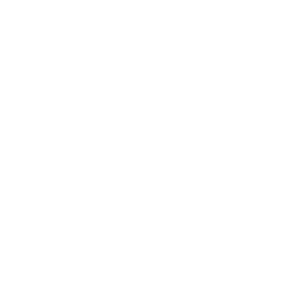

# AG WebDev – Modernes Webdesign, Entwicklung & SEO



**Website:** [https://www.ag-webdev.de/](https://www.ag-webdev.de/)

---

## Über das Projekt

AG WebDev ist ein modernes Webprojekt basierend auf Next.js, React und modularen CSS-Lösungen.  
Ziel ist die Erstellung und Präsentation von hochwertigen Websites, Referenzen und Blogartikeln für Unternehmen, Freelancer und Selbständige – mit Fokus auf **Sichtbarkeit, Conversion und Performance**.

- **Tech Stack:** Next.js 14+, React 18+, TypeScript, CSS Modules, Framer Motion, EmailJS, Vercel Hosting
- **SEO:** Strukturiertes Daten-Markup (Schema.org), OpenGraph, dynamische Meta-Tags, Bild-Optimierung, 100/100 Lighthouse Score

---

## Features

- 🚀 **Blitzschnelle Performance** (Static Generation & SSR mit Next.js)
- 🎨 **Modernes UI/UX** – Custom Komponenten, Animationen (Framer Motion)
- 📈 **SEO-Optimiert** – Structured Data, OG, Canonicals, Keywords, Responsive
- 🖼️ **Portfoliobereich & Referenzen** mit echtem Kundenfeedback (Rich-Snippets)
- 📚 **Blog** – Dynamisches Routing, Markdown-Support, SEO-kompatibel
- 📨 **Kontaktformular** – Validierung, EmailJS Integration, Spam-Schutz
- 🌍 **Bereit für Internationalisierung** (Struktur ausgelegt für weitere Sprachen)
- 🛡️ **Datenschutz & DSGVO**: Cookie Hinweis, Privacy Policy

---

## Projektstruktur

src/
app/
about/
kontakt/
referenzen/
oberholzer-umzugservice/
certus-solutions/
blog/
[slug]/
webdesign/
...
components/
common/
Header.tsx
Footer.tsx
...
public/
images/
logo-2.png
...
styles/
globals.css

---

## Installation & Entwicklung

```bash
# 1. Repository klonen
git clone https://github.com/DeinGitUser/ag-webdev.git
cd ag-webdev

# 2. Abhängigkeiten installieren
npm install

# 3. Lokalen Dev-Server starten
npm run dev
# öffne http://localhost:3000

Deployment
Deploy via Vercel

Alternativ: Docker, Netlify oder traditionell via Node.js Hosting

Konfiguration
Environment-Variablen: .env.local für API Keys (z.B. EmailJS, reCAPTCHA)

SEO-Einstellungen: Siehe metadata in jeder Seite (app/[page]/page.tsx)

Images: Komprimierte Bilder in public/images – nutze Next.js <Image /> für beste Performance

Mitwirken
Pull Requests sind willkommen!
Bitte erstelle ein Issue für Bugs oder Feature Requests.

Kontakt
Alexandru Gheorghe
Freelance Webdesigner & Entwickler
contact@ag-webdev.de

Lizenz
MIT License

AG WebDev – Moderne Weblösungen für mehr Erfolg 🚀
www.ag-webdev.de
```
